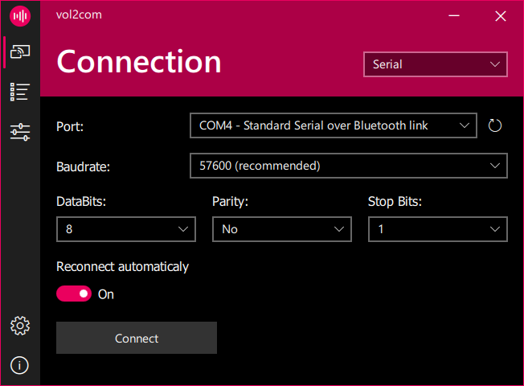
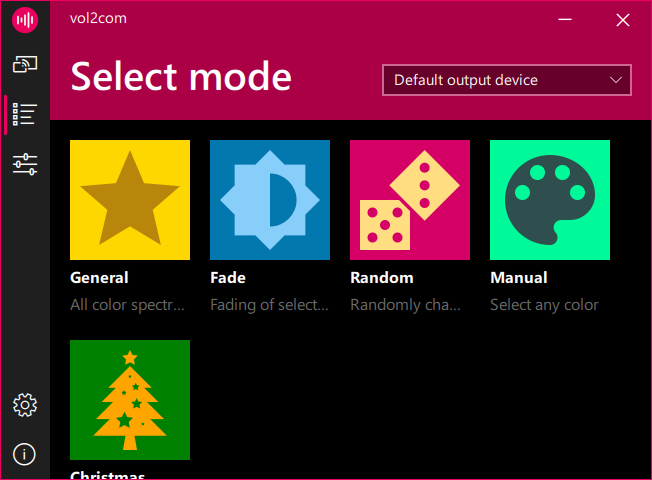
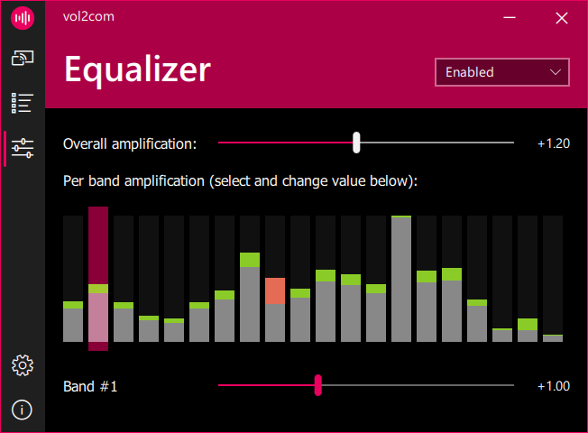
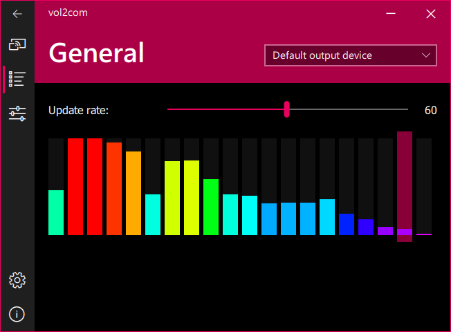
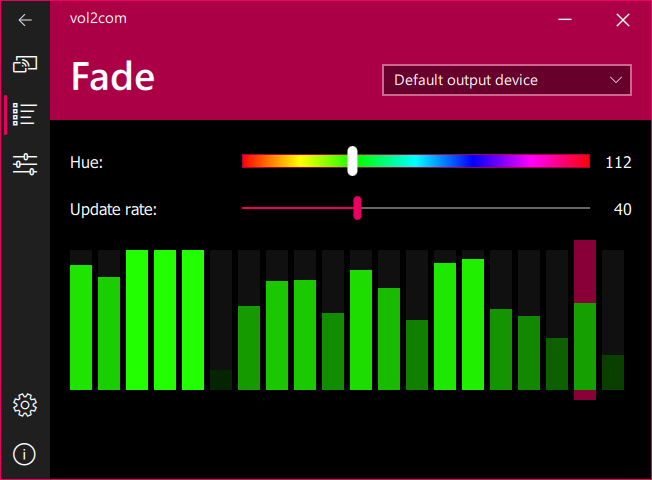
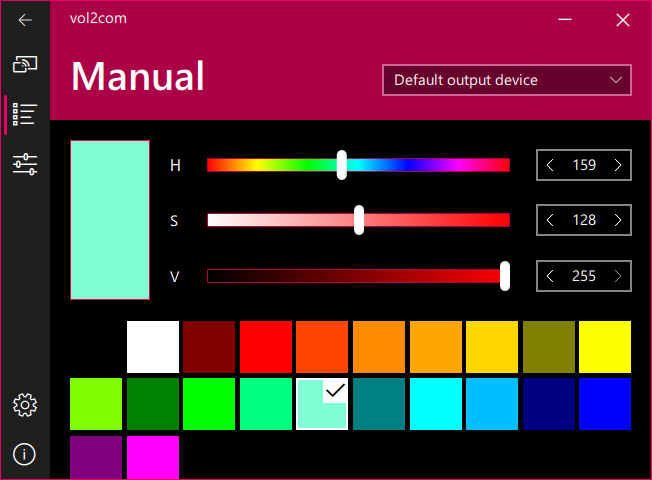

# vol2com
Simple open source LED strip management software.
The main advantage of the program is the ability to control the color depended on the music being played. Also, the advantages of the program include support for various types of connections, a large number of operating modes (with the settings for each of them), the presence of an equalizer for fine-tuning the values and a lot of other useful functions.

  
  
  

- [Features](#features)
- [Operating modes](#modes)
- [How to build](#build)
- [SAST Tools](#sast)
- [Dependencies](#deps)

## Features
* Serial connection
* Various work modes
* "Equalizer" for fine-tuning
* Multi-language (at the moment English and Russian)

## Operating modes
| Name | Description | Screenshot |
| ------------- |:-------------:| -----:|
| General | Analyses sound and send color corresponding color |  |
| Fade | Blinks selected color to the beat of the music |  |
| Random | Smoothly changes current color in random direction | Nothing to see here :) |
| Manual | Sends selected color. HSV color selector available and a few predefined colors |  |

You can suggest new operating modes via [issues](https://github.com/Mixxxxa/vol2com/issues).

## How to build and run
Tested with Qt 6.6.1
1. Clone the repository
2. Configure CMake project (it will automatically download and configure all dependencies)
5. Build and run

## SAST Tools
[PVS-Studio](https://pvs-studio.com/pvs-studio/?utm_source=website&utm_medium=github&utm_campaign=open_source) - static analyzer for C, C++, C#, and Java code.

## Dependencies
Thank you to the developers of these wonderful libraries:
* [Qt](https://qt.io/)
* [Bass](https://www.un4seen.com/)
* [WinToast](https://github.com/mohabouje/WinToast/)

