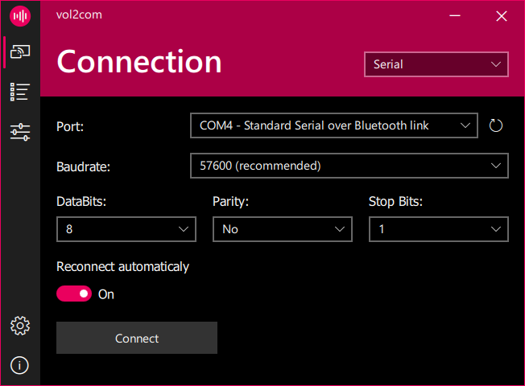
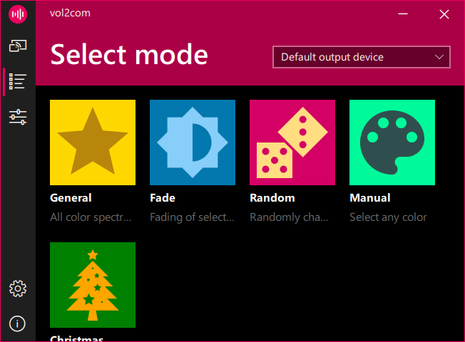
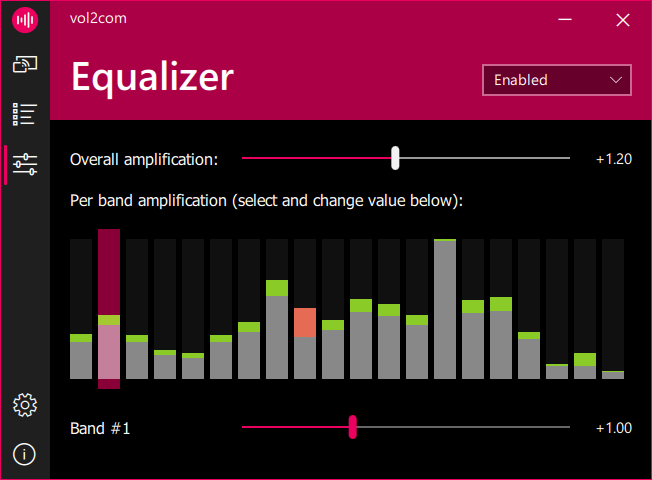
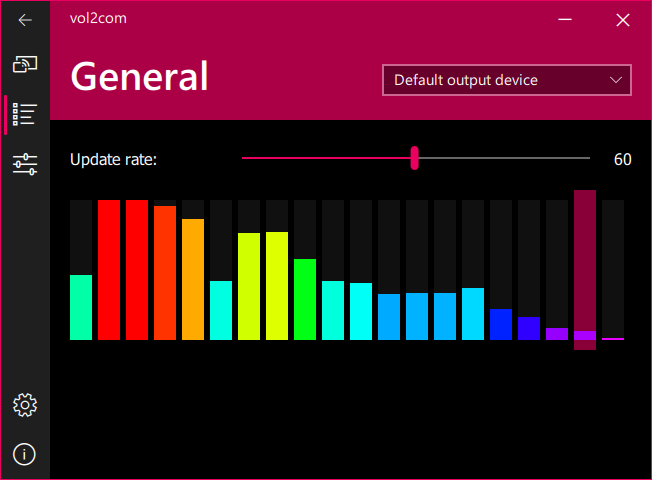
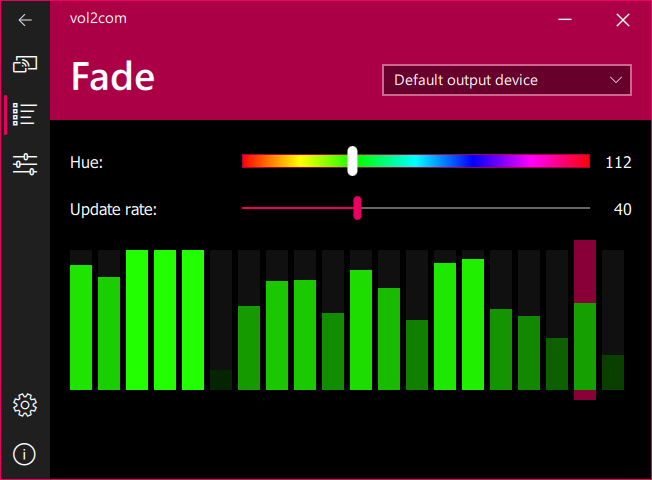
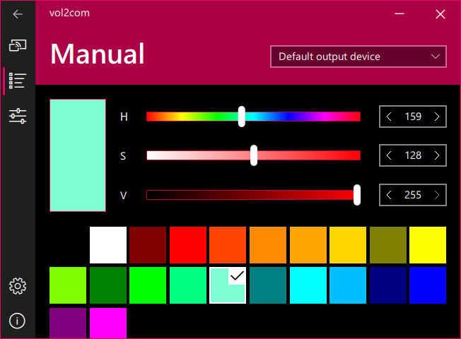

# vol2com
Simple open source LED strip management software.
The main advantage of the program is the ability to control the color depended on the music being played. Also, the advantages of the program include support for various types of connections, a large number of operating modes (with the settings for each of them), the presence of an equalizer for fine-tuning the values and a lot of other useful functions.

  
  
  

- [Features](#features)
- [Operating modes](#modes)
- [How to build](#build)
- [Planned features](#future)

## Features
* Serial connection (Bluetooth via COM)
* Various work modes
* "Equalizer" for fine-tuning
* Multi-language (at the moment English and Russian)
* Notifications support (Windows 10+)

## Operating modes
| Name | Description | Screenshot |
| ------------- |:-------------:| -----:|
| General | Analyses sound and send color corresponding color |  |
| Fade | Blinks selected color to the beat of the music |  |
| Random | Smoothly changes current color in random direction | Nothing to see here) |
| Manual | Sends selected color. HSV color selector available and a few predefined colors |  |

You can suggest new operating modes via [issues](https://github.com/Mixxxxa/vol2com/issues).

## How to build and run
Tested with Qt 5.15.2
1. Clone the repository
2. Download and place dependencies in `/src/libs`
3. Open vol2com.pro file and build
4. Place `bass.dll` and `bass_wasapi.dll` (don't forget about bitness 32/64).
5. Run builded exe

## Planned features
* Start at system startup
* Ability to minimize to system tray and corresponding menu for the most frequency used functions.
* Remote Control module - program will can perform various actions by request from the LED controller.
* Support connection via WebSocket's
